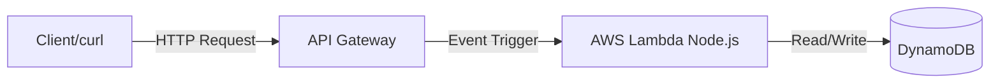

# Serverless Todo API Project

Built and deployed a production-ready, serverless REST API!

## Architecture Delivered



## What We Built
1. **Infrastructure as Code (IaC)**:  wrote a `template.yaml` file defining 5 Lambda functions, API routes, and a DynamoDB table.
2. **Business Logic**: wrote 5 separate Node.js scripts using the AWS SDK v3 to handle CRUD operations.
3. **Deployment**: Used the AWS SAM CLI to package the code and deploy it via CloudFormation to the AWS Cloud.
4. **Testing**: Verified the live endpoint using `curl`.

## Important Links & Commands

**Your Live API URL:**
`https://w4ud3d59n0.execute-api.us-east-1.amazonaws.com/Prod/todos`

**Test Commands:**
*   Create a Todo:
    ```bash
    curl -X POST https://w4ud3d59n0.execute-api.us-east-1.amazonaws.com/Prod/todos -H "Content-Type: application/json" -d '{"title": "Test"}'
    ```
*   List Todos:
    ```bash
    curl https://w4ud3d59n0.execute-api.us-east-1.amazonaws.com/Prod/todos
    ```

> [!TIP]
> **Cost Optimization**
> This entire stack costs $0 to run. The Lambdas are only billed when invoked (first 1M are free), and DynamoDB is set to On-Demand billing (Pay-Per-Request). If no one hits the API, the cost is literally $0.00.

> [!WARNING]
> **Tear Down**
> To delete this entire project off AWS, you just run `sam delete` in your terminal. AWS will automatically find all the Lambdas, API Gateways, and Tables connected to this project and securely delete them.
